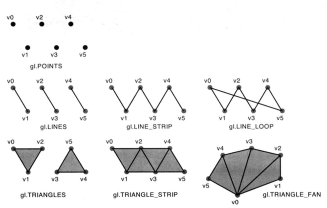

# ch2
## 坐标图
 > 
 >canvas的坐标横轴为x轴(正方向朝右),纵轴为y轴(正方向朝下) 
 
 >webgl的右手坐标 
 
 >对应坐标 
 ## 绘图简单步骤
 
1. 获取canvas: `var canvas = doucment.getElementById('webgl')`
2. 获取上下文: `var gl = getWebGLContext(canvas)`
3. 初始化着色器  `initShader(gl, VSHADER_SOURCE, FSHADER_SOURCE)`
4. 设置背景色: `gl.clearColor(0.0, 0.0, 0.0, 1.0)`
5. 清空canvas: `gl.clear(gl.COLOR_BUFFER_BIT)`
6. 绘图: `gl.drawArrays(gl.POINTS, 0, 1)`
## 使用变量
1. 声明: `attribute vec4 a_Position;\n`
2. 将变量赋值给gl_Position: `gl_Position = a_Position;\n`
3. 向变量传输数据: 
>`var a_Position = gl.getAttribLocation(gl.program, 'a_Position')` 
>`gl.vertexAttrib3f(a_Position, 0.0, 0.0, 0.0)`
## 要点
1. WebGL程序包括运行在浏览器中的Javascript和运行在WebGL系统的着色器程序俩个部分
2. vec4 四个浮点数 组成的矢量(也称为齐次坐标是四维的,通常把最后一个变量设置为1.0代表三维)
3. 顶点着色器两个内置变量: `gl_Position, gl_PointSize`
4. 片元着色器内置变量:  `gl_FragColor`
5. attribute变量: 传输与顶点相关的数据, unifrom变量传输对所有顶点相同的数据(或与顶点无关)
 

# ch3
## 绘制多点(使用缓冲区)
1. 创建缓冲区对象: `var vertexBuffer = gl.creteBuffer()`
2. 绑定缓冲区对象: `gl.bindBuffer(gl.ARRAY_BUFFER, vextexBuffer)`
3. 将数据写入缓冲区: `gl.bufferData(gl.ARRAY_BUFFER, vertices, gl.STATIC_DRAW)`
4. 将缓冲区对象分配给一个attribute变量(多点一次性分配)): `gl.vertexAttribPointer(a_Position, 2, gl.FLOAT, false, 0, 0)`
5. 开启attribute变量(为了使顶点着色器能够访问缓冲区数据):  `gl.enableVertexAttribArray(a_Position)`
## 要点
1. `new Float32Array([])`类型化数组: `BYTES_PER_ELEMENT` 数组中每个元素所占的字节数
## WebGl绘制基本图形
>`gl.drawArrays(gl.TRIANGLES, 0, n)`
> 
